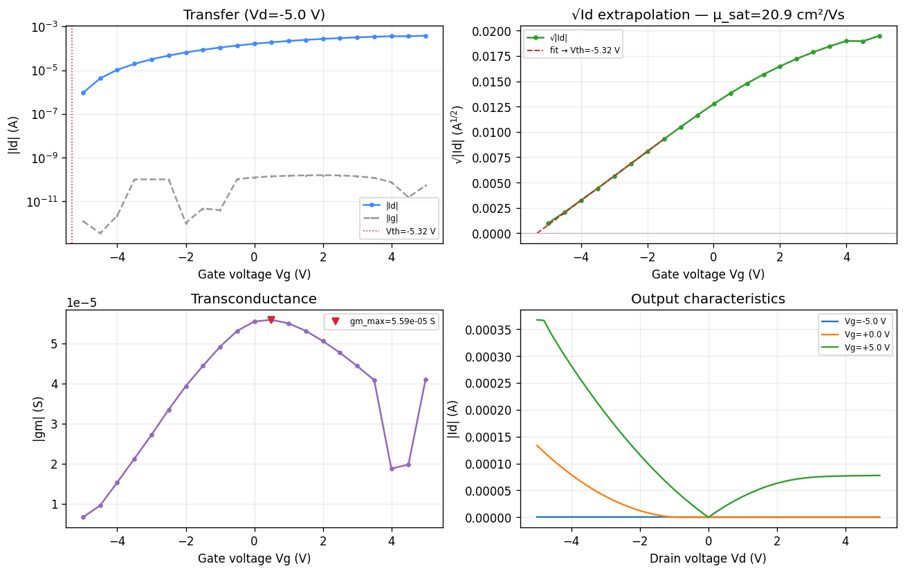

# TFT Measurement Viewer

Browse and analyse individual TFT device measurements from a wafer, with a
sortable data table and spatial / statistical plots.

## Features

- Wafer list with measured-device counts (metadata preloaded at startup).
- In-memory filtering by pass/fail status, defect type, and parameter range.
- Sortable measurement table with pass/fail row colouring.
- Plot panel: spatial maps, pass/fail histograms, and parameter correlation
  scatter plots (with a matplotlib navigation toolbar).
- Export the currently filtered set to CSV.

## Run

```bash
# From the project root, install dependencies once:
pip install -r requirements.txt

# Initialise the shared database (safe to re-run):
python init_database.py

# Launch the viewer:
python TFT_measurement_viewer/run.py
```

The viewer reads `TFT_Database.db` in the project root. If it has no wafers
yet, populate it with your import tooling first — this module is read-only.

## Smoke test

```bash
python TFT_measurement_viewer/smoke_import.py
```

See `docs/ARCHITECTURE.md` and `docs/USAGE_GUIDE.md` for details.

## Curve Analysis tab

A second tab loads raw **Id-Vg** (transfer) and **Id-Vd** (output) sweeps
(`.xls`/`.csv`) and extracts the standard TFT figures of merit via
`shared/tft_analysis.py`:

- **Transfer:** threshold voltage Vth (√Id saturation extrapolation),
  subthreshold swing SS, on/off ratio, Ion/Ioff, peak transconductance gm,
  saturation field-effect mobility μ_sat, gate leakage.
- **Output (per Vg):** saturation current Idsat, on-resistance Ron, output
  conductance gd.

W and L are auto-parsed from an `L<#>W<#>` token in the filename; the oxide
thickness/εr drive the Cox used for Vth and mobility. Reading legacy `.xls`
needs `xlrd` (in requirements).


