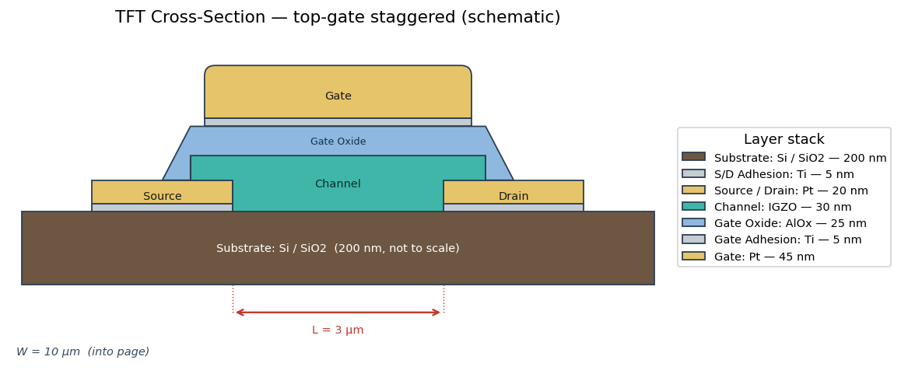

# TFT Recipe Builder

Create, edit, and manage TFT fabrication recipes and their ordered process
steps.

## Features

- Saved-recipe list with New / Load / Delete.
- Step editor table; add, edit, remove and reorder process steps.
- Per-step parameters: process type, name, temperature, duration, pressure,
  RF power, gas mixture (`SiH4:50, N2O:200` form, stored as JSON) and notes.
- Live validation (required fields, non-negative pressure/power, positive
  duration, per-process-type temperature ranges).
- **Working in-memory database** auto-saves the in-progress draft; an explicit
  **Save Recipe** commits it to the persistent `recipes` / `recipe_steps`
  tables.
- Recipe summary with step count and estimated total duration.

## Run

```bash
pip install -r requirements.txt
python init_database.py          # from project root, safe to re-run
python TFT_recipe_builder/run.py
```

## Smoke test

```bash
python TFT_recipe_builder/smoke_import.py
```

See `docs/ARCHITECTURE.md` and `docs/RECIPE_GUIDE.md`.

## Device Structure tab

A second tab, **Device Structure**, shows a live 2D cross-section of a top-gate
staggered TFT (default values from the IGZO TFT in Panca et al.):

- Substrate (Si/SiO₂) → Source/Drain (Ti/Pt) → IGZO channel → AlOx gate oxide →
  Ti/Pt gate.
- Every layer's **material is editable** (type any material; known ones get a
  fixed colour, custom ones get a stable auto-colour) and its **thickness (nm)**
  is adjustable.
- Channel length **L**, width **W**, and the S/D / gate overlaps update the
  drawing live.
- **Load IGZO Defaults** restores the paper values; **Export PNG…** saves the
  figure.


